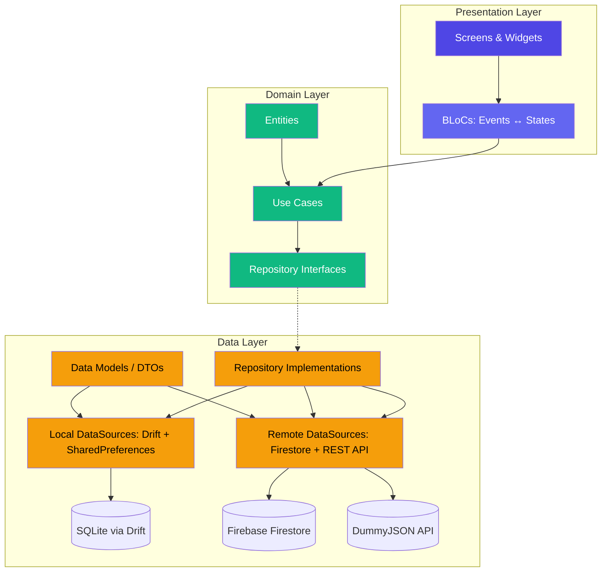
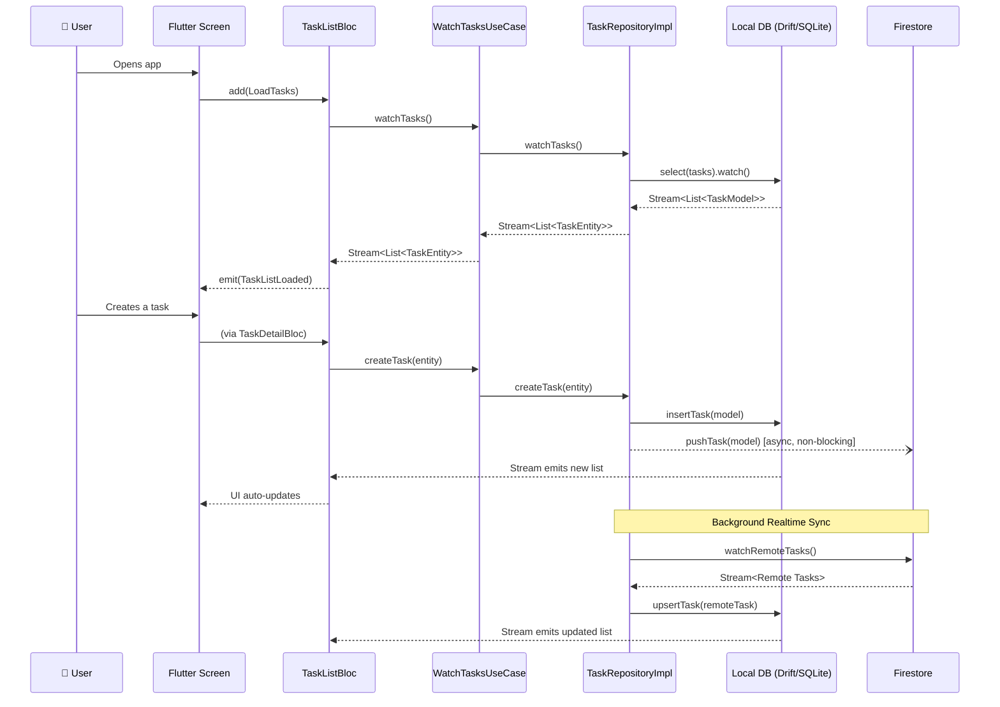

# 📋 Taskly — Smart Task Manager

> A modern, offline-first, cross-platform task management application built with **Flutter** and **Dart**. Taskly demonstrates professional-grade mobile architecture, real-time cloud synchronization, and a premium UI/UX experience.

---

## 📑 Table of Contents

- [Overview](#overview)
- [Key Features](#key-features)
- [Screenshots & App Flow](#screenshots--app-flow)
- [Architecture](#architecture)
- [Tech Stack](#tech-stack)
- [Project Structure](#project-structure)
- [Data Flow](#data-flow)
- [Offline-First Strategy](#offline-first-strategy)
- [State Management (BLoC)](#state-management-bloc)
- [Dependency Injection (GetIt)](#dependency-injection-getit)
- [Authentication](#authentication)
- [Installation & Setup](#installation--setup)
- [Running the App](#running-the-app)
- [Testing](#testing)
- [Deployment](#deployment)
- [API Integration](#api-integration)
- [Performance Optimizations](#performance-optimizations)
- [Future Enhancements](#future-enhancements)

---

## Overview

**Taskly** is a fully functional task management application designed as a final project for Cross-Platform Mobile Development. It showcases advanced Flutter development practices including:

- **Clean Architecture** with strict layer separation (Data / Domain / Presentation)
- **BLoC Pattern** for predictable, testable state management
- **Offline-First Design** with local SQLite storage (Drift) and background cloud sync (Firebase Firestore)
- **Firebase Authentication** with per-user data isolation
- **External API Integration** (DummyJSON REST API via Dio)
- **Unit & Widget Tests** using `mocktail` and `bloc_test`

The app supports both **Android** and **iOS** platforms with a single codebase, featuring full dark/light theme support, animations, responsive design, and platform-adaptive aesthetics.

---

## Key Features

| Feature | Description |
|---|---|
| **Offline-First CRUD** | Create, read, update, and delete tasks locally — no internet required |
| **Cloud Sync** | Bidirectional sync with Firebase Firestore when network is available |
| **Realtime Updates** | Live Firestore stream merges remote changes into local DB automatically |
| **Firebase Auth** | Email/password authentication with per-user data isolation |
| **Dark/Light Theme** | Toggle theme from settings; preference persisted via SharedPreferences |
| **Task Filtering** | Filter by status: All / To Do / Done |
| **Task Priorities** | Low, Medium, High — with color-coded visual indicators |
| **Deadlines & Overdue** | Set due dates, see progress bars, and overdue badges on task cards |
| **Statistics Dashboard** | Pie chart (fl_chart) showing task distribution, completion rate, overdue count |
| **Import API Data** | Fetch sample todos from DummyJSON REST API and import them as local tasks |
| **Swipe to Delete** | Dismiss a task card with a swipe gesture |
| **Pull to Refresh** | Pull down on the task list to trigger cloud sync |
| **Smooth Animations** | Entrance animations on cards and FAB via `flutter_animate` |
| **Custom Typography** | Google Fonts (Inter for body, Outfit for headings) |

---

## Screenshots & App Flow

```
Login ──► Home (Task List) ──► Task Detail ──► Edit Task
  │            │                                    │
  ▼            ├──► Create Task ◄───────────────────┘
Register       ├──► Statistics (Charts)
               └──► Settings (Theme, Sync, Import, Logout)
```

**Screen list:**
- `LoginScreen` — email/password sign-in
- `RegisterScreen` — new account creation with password confirmation
- `HomeScreen` — main task list with filtering, swipe-to-delete, status toggle
- `CreateTaskScreen` — create or edit a task (title, description, priority, deadline)
- `TaskDetailScreen` — read-only view of a single task with all details
- `StatisticsScreen` — visual analytics with pie chart and stat cards
- `SettingsScreen` — dark mode toggle, cloud sync, API import, logout
- `ErrorScreen` — 404 fallback for invalid routes

---

## Architecture

Taskly follows **Clean Architecture** principles, ensuring separation of concerns, testability, and scalability:



### Why Clean Architecture?

| Benefit | How Taskly Achieves It |
|---|---|
| **Testability** | Domain layer has zero Flutter imports — pure Dart business logic |
| **Maintainability** | Changing the database (e.g., Drift → Isar) requires edits only in the data layer |
| **Scalability** | Adding a new feature means adding a UseCase + BLoC — existing code stays untouched |
| **Separation of Concerns** | UI knows nothing about Firestore; Domain knows nothing about Flutter |

---

## Tech Stack

| Category | Technology | Purpose |
|---|---|---|
| **Framework** | Flutter 3.x / Dart 3.x | Cross-platform UI framework |
| **State Management** | `flutter_bloc` | BLoC pattern for predictable state |
| **Value Equality** | `equatable` | Value-based equality for events, states, entities |
| **Local Database** | `drift` (SQLite) | Type-safe, reactive local persistence |
| **Cloud Database** | `cloud_firestore` | Realtime NoSQL cloud storage |
| **Authentication** | `firebase_auth` | Email/password auth |
| **Networking** | `dio` | HTTP client for REST API calls |
| **Dependency Injection** | `get_it` | Service locator for dependency management |
| **Routing** | `go_router` | Declarative URL-based navigation |
| **Preferences** | `shared_preferences` | Key-value local storage for settings |
| **Charts** | `fl_chart` | Data visualization (pie charts) |
| **Animations** | `flutter_animate` | Declarative entrance/exit animations |
| **Typography** | `google_fonts` | Inter & Outfit font families |
| **Date Formatting** | `intl` | Locale-aware date formatting |
| **UUID** | `uuid` | Universally unique identifiers for tasks |
| **Connectivity** | `connectivity_plus` | Network state monitoring |
| **Code Generation** | `build_runner` + `drift_dev` | Auto-generates Drift database code |
| **Testing** | `flutter_test` + `mocktail` + `bloc_test` | Unit, widget, and BLoC tests |
| **Deployment** | `flutter_launcher_icons` + `flutter_native_splash` | Custom icons and splash screens |

---

## Project Structure

```
lib/
├── main.dart                         # App entry point (Firebase init, DI, launch)
├── firebase_options.dart             # Auto-generated Firebase configuration
│
├── app/                              # App-level configuration
│   ├── app.dart                      # TasklyApp widget (GoRouter + MultiBlocProvider)
│   ├── di/
│   │   └── injection.dart            # GetIt service locator setup
│   └── theme/
│       ├── app_colors.dart           # Color palette constants
│       └── app_theme.dart            # Light & Dark ThemeData definitions
│
├── core/                             # Shared utilities
│   └── error/
│       └── failures.dart             # Typed failure classes (Server, Cache, Network, Auth, Validation)
│
├── data/                             # Data Layer — implementations and data sources
│   ├── database/
│   │   ├── app_database.dart         # Drift table definitions & database class
│   │   └── app_database.g.dart       # Auto-generated Drift code
│   ├── datasources/
│   │   ├── local/
│   │   │   ├── task_local_ds.dart    # SQLite CRUD via Drift (watch, insert, upsert, etc.)
│   │   │   └── prefs_local_ds.dart   # SharedPreferences for theme settings
│   │   └── remote/
│   │       ├── task_remote_ds.dart   # Firestore CRUD (push, watch, delete per user)
│   │       └── api_remote_ds.dart    # REST API client (DummyJSON) via Dio
│   ├── models/
│   │   ├── task_model.dart           # DTO with JSON ↔ Drift ↔ Entity conversions
│   │   └── api_todo_model.dart       # DTO for external API response
│   ├── repositories/
│   │   ├── task_repository_impl.dart # Orchestrates local/remote data flow
│   │   └── settings_repository_impl.dart # Delegates to SharedPreferences
│   └── services/
│       ├── auth_service.dart         # Firebase Auth wrapper (sign in, sign up, sign out)
│       ├── auth_gate.dart            # StreamBuilder that routes to app or login
│       └── login_or_register.dart    # Toggle widget between Login and Register
│
├── domain/                           # Domain Layer — pure business logic (no Flutter imports)
│   ├── entities/
│   │   └── task_entity.dart          # Core TaskEntity (Equatable) + enums (TaskStatus, TaskPriority)
│   ├── repositories/
│   │   ├── task_repository.dart      # Abstract contract for task operations
│   │   └── settings_repository.dart  # Abstract contract for settings
│   └── usecases/
│       └── task_usecases.dart        # WatchTasks, CreateTask, UpdateTask, DeleteTask, SyncTasks, ImportTasks
│
└── presentation/                     # Presentation Layer — UI and state management
    ├── blocs/
    │   ├── task_list_bloc.dart        # Main task list (stream subscription, filter, delete, status toggle)
    │   ├── task_detail_bloc.dart      # Create/edit single task
    │   ├── settings_bloc.dart         # Theme, sync, import operations
    │   └── stats_bloc.dart            # Real-time statistics computation
    ├── screens/
    │   ├── home_screen.dart           # Task list with filter bar, swipe-to-delete, FAB
    │   ├── create_task_screen.dart     # Form for creating/editing tasks
    │   ├── task_detail_screen.dart     # Read-only task details
    │   ├── statistics_screen.dart      # Pie chart and stat cards
    │   ├── settings_screen.dart        # Preferences, sync, import, logout
    │   ├── login_screen.dart           # Login form
    │   ├── register_screen.dart        # Registration form
    │   └── error_screen.dart           # 404 fallback
    └── widgets/
        ├── task_card.dart             # Rich task card with priority chip, deadline, progress bar
        ├── task_filter_bar.dart       # ChoiceChips for filtering (All / To Do / Done)
        ├── my_button.dart             # Reusable styled button with loading state
        └── my_text_field.dart         # Reusable styled text input with prefix icon

test/
├── domain/
│   └── usecases/
│       └── task_usecases_test.dart    # Unit tests: CreateTask, DeleteTask, SyncTasks
└── presentation/
    └── widgets/
        └── task_card_test.dart        # Widget test: TaskCard rendering and interaction
```

---

## Data Flow



### Step-by-step flow:

1. **UI sends Event** → The user interacts with the screen, which dispatches a BLoC event (e.g., `LoadTasks`).
2. **BLoC calls UseCase** → The BLoC delegates to a UseCase, keeping business logic out of the UI.
3. **UseCase calls Repository** → The UseCase calls the abstract repository interface (domain layer).
4. **Repository orchestrates data** → The implementation decides whether to hit local DB, remote DB, or both.
5. **Local DB provides reactive stream** → Drift's `.watch()` emits a new `List<TaskModel>` every time data changes.
6. **BLoC emits new State** → The new data flows through the stream → BLoC transforms it → emits `TaskListLoaded` → UI rebuilds.

---

## Offline-First Strategy

Taskly is designed around an **offline-first** principle:

| Scenario | Behavior |
|---|---|
| **No internet** | All CRUD operations work on the local SQLite database. Tasks are created with `isSynced: false`. |
| **Internet available** | After local save, the repository attempts a fire-and-forget push to Firestore. If successful, `isSynced` is set to `true`. |
| **Manual sync** | The user can trigger "Sync with Cloud" from Settings, which pushes all unsynced tasks and pulls remote changes. |
| **Realtime sync** | Upon login, a Firestore snapshot listener streams remote changes and upserts them locally. |
| **Conflict resolution** | Last-write-wins strategy via Firestore's `SetOptions(merge: true)` and Drift's `insertOnConflictUpdate`. |

---

## State Management (BLoC)

The app uses **4 BLoCs**, each managing a distinct domain of application state:

| BLoC | Responsibility | Key Events | Key States |
|---|---|---|---|
| `TaskListBloc` | Main task list, filtering, deletion, status toggle | `LoadTasks`, `FilterTasks`, `DeleteTaskEvent`, `UpdateTaskStatusEvent` | `TaskListLoading`, `TaskListLoaded`, `TaskListError` |
| `TaskDetailBloc` | Create/edit a single task | `SaveTaskEvent` | `TaskDetailInitial`, `TaskDetailSaving`, `TaskDetailSuccess`, `TaskDetailError` |
| `SettingsBloc` | Theme, cloud sync, API import | `LoadSettings`, `ToggleTheme`, `SyncData`, `ImportData` | `SettingsState` (with `isDarkMode`, `isSyncingCloud`, `isImportingData`, `message`) |
| `StatsBloc` | Real-time statistics | `LoadStats` | `StatsLoading`, `StatsState` (with `totalTasks`, `todoTasks`, `doneTasks`, `overdueTasks`) |

All BLoC events and states extend `Equatable`, enabling efficient rebuilds — Flutter only re-renders when the state *actually changes* (by value, not by reference).

---

## Dependency Injection (GetIt)

Taskly uses **GetIt** as a service locator to manage object creation and lifecycle:

```
configureDependencies() is called once at app startup (main.dart).
It registers all dependencies in a bottom-up order:
  Infrastructure → DataSources → Repositories → UseCases → BLoCs
```

| Registration Type | Used For | Behavior |
|---|---|---|
| `registerLazySingleton` | Database, Dio, Firestore, DataSources, Repositories, UseCases | Created once on first access; same instance reused forever |
| `registerFactory` | All BLoCs | A **new** instance is created each time; prevents stale state between navigations |

**Why Factories for BLoCs?** If a BLoC were a singleton, navigating away and back to a screen would reuse old state. Factory registration guarantees a fresh BLoC instance for every screen mount.

---

## Authentication

| Component | Role |
|---|---|
| `AuthService` | Wrapper around `FirebaseAuth` — handles signIn, signUp, signOut |
| `AuthGate` | A `StreamBuilder` listening to `FirebaseAuth.authStateChanges()` — shows `TasklyApp` if logged in, or `LoginOrRegister` if not |
| `LoginOrRegister` | A stateful toggle widget that switches between `LoginScreen` and `RegisterScreen` |

### Firestore Data Isolation

Each user's tasks are stored under their own Firestore path: `Users/{userId}/tasks/{taskId}`. This ensures complete data isolation between users.

### Logout Flow

On logout, the app:
1. Clears all local task data (`clearLocalData()`) — prevents data leaking between user accounts
2. Calls `FirebaseAuth.signOut()`
3. `AuthGate` detects the auth state change and redirects to the login screen

---

## Installation & Setup

### Prerequisites

- [Flutter SDK](https://docs.flutter.dev/get-started/install) (>= 3.11.0)
- [Dart SDK](https://dart.dev/get-dart) (>= 3.11.0)
- [Firebase CLI](https://firebase.google.com/docs/cli) (for Firebase project configuration)
- Android Studio / Xcode (for emulators/simulators)

### Steps

1. **Clone the repository:**
   ```bash
   git clone <repository-url>
   cd final_project
   ```

2. **Install dependencies:**
   ```bash
   flutter pub get
   ```

3. **Generate Drift database code** (only if you modify `app_database.dart`):
   ```bash
   dart run build_runner build --delete-conflicting-outputs
   ```

4. **Firebase configuration:**
   - The project is pre-configured with `firebase_options.dart` for the `cpmd-final` Firebase project.
   - If using your own Firebase project, run:
     ```bash
     flutterfire configure
     ```
   - Ensure **Firestore** and **Authentication (Email/Password)** are enabled in the Firebase Console.

5. **Generate launcher icons and splash screen** (optional, already done):
   ```bash
   dart run flutter_launcher_icons
   dart run flutter_native_splash:create
   ```

---

## Running the App

```bash
# List available devices
flutter devices

# Run in debug mode
flutter run

# Run on a specific device
flutter run -d <device-id>

# Build release APK (Android)
flutter build apk --release

# Build release IPA (iOS)
flutter build ipa --release
```

---

## Testing

Taskly includes both **unit tests** and **widget tests**:

### Unit Tests (`test/domain/usecases/`)

Tests pure business logic by mocking the repository layer with `mocktail`:

- ✅ `CreateTaskUseCase` — verifies it calls `repository.createTask()`
- ✅ `DeleteTaskUseCase` — verifies it calls `repository.deleteTask()`
- ✅ `SyncTasksUseCase` — verifies it calls `repository.syncWithCloud()`

### Widget Tests (`test/presentation/widgets/`)

Tests UI rendering and user interaction:

- ✅ `TaskCard` — verifies title and priority are displayed, toggle callback fires on tap

### Running Tests

```bash
# Run all tests
flutter test

# Run with verbose output
flutter test --reporter expanded

# Run a specific test file
flutter test test/domain/usecases/task_usecases_test.dart
```

---

## Deployment

### Android

1. Update `android/app/build.gradle` with signing configuration.
2. Build a release APK or App Bundle:
   ```bash
   flutter build apk --release
   flutter build appbundle --release
   ```
3. Upload to **Google Play Console**.

### iOS

1. Open `ios/Runner.xcworkspace` in Xcode.
2. Configure signing & capabilities with your Apple Developer account.
3. Build the archive:
   ```bash
   flutter build ipa --release
   ```
4. Upload to **App Store Connect** via Xcode or Transporter.

### Custom Assets

| Asset | Config |
|---|---|
| **App Icon** | `assets/icon/app_icon.png` → generated via `flutter_launcher_icons` |
| **Splash Screen** | `assets/splash/splash_logo.png` → generated via `flutter_native_splash` |

---

## API Integration

Taskly integrates with the **DummyJSON REST API** (`https://dummyjson.com/todos`) to demonstrate external API consumption:

- **HTTP Client:** Dio with 5s connect / 3s receive timeouts
- **Flow:** User taps "Import Sample Tasks" → `SettingsBloc` → `ImportTasksUseCase` → `TaskRepositoryImpl` → `ApiRemoteDataSourceImpl.fetchTodos()` → first 10 todos are mapped to `TaskModel` objects with UUID-generated IDs and inserted into the local database
- **Error Handling:** Network errors are caught and displayed to the user via SnackBar messages

---

## Performance Optimizations

| Optimization | Implementation |
|---|---|
| **Lazy Database** | `LazyDatabase` defers SQLite file creation until the first query, reducing startup time |
| **Lazy Singletons** | GetIt's `registerLazySingleton` creates objects only on first access |
| **Reactive Streams** | Drift's `.watch()` avoids polling — the database pushes updates when data changes |
| **Non-blocking Cloud Push** | `_pushToCloud()` runs asynchronously without awaiting, so UI operations remain instant |
| **Stream Subscription Cleanup** | All BLoCs cancel stream subscriptions in `close()` to prevent memory leaks |
| **Equatable States** | BLoC states use value equality — Flutter skips rebuilds when the state hasn't actually changed |
| **Background DB Init** | `NativeDatabase.createInBackground()` initializes the SQLite database on a background isolate |

---

## Future Enhancements

- [ ] Push notifications for upcoming deadlines
- [ ] Task categories/tags for better organization
- [ ] Drag-and-drop reordering of tasks
- [ ] Multi-language support (i18n)
- [ ] Google/Apple social sign-in
- [ ] Task attachments (images, files)
- [ ] Collaborative task sharing between users
- [ ] Widget for home screen (Android/iOS)

---

## License

This project was developed as an academic final project for the Cross-Platform Mobile Development course.

---

<p align="center">
  Built with ❤️ using Flutter & Dart
</p>
