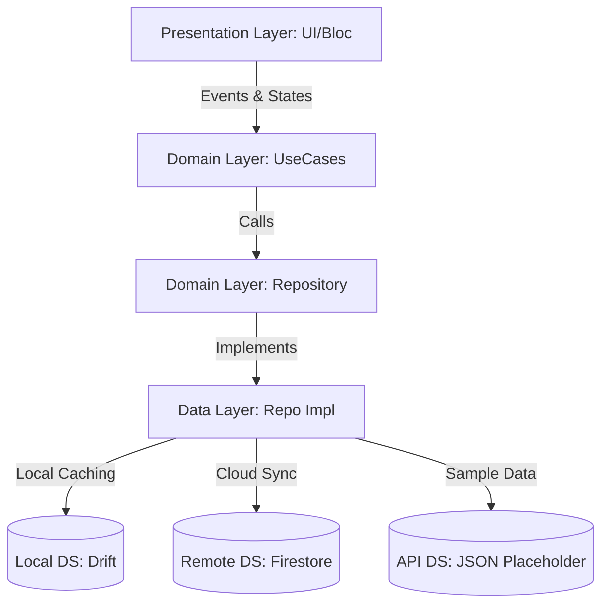
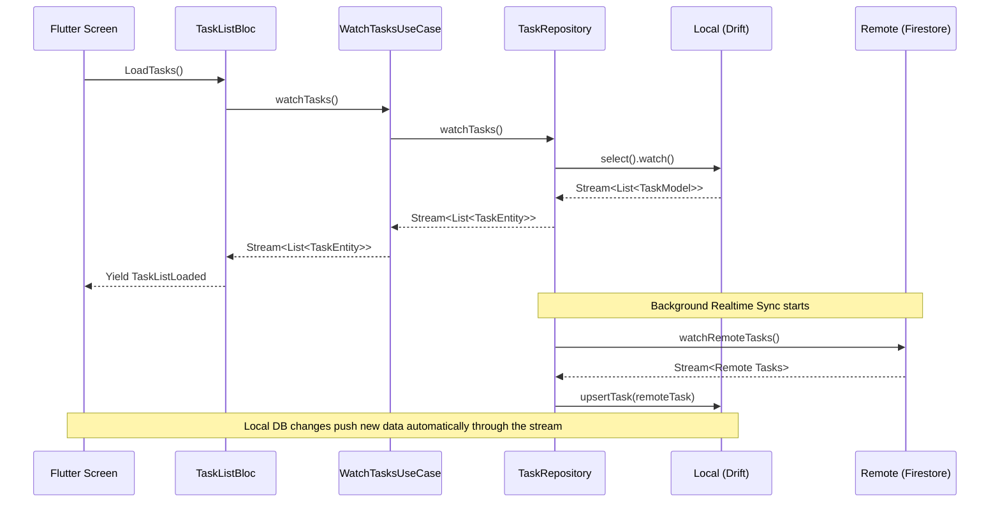

# Taskly - Smart Task Manager

Taskly is a modern, offline-first professional Flutter application for task management. It implements Clean Architecture and the BLoC pattern, with a focus on a high-quality UI/UX and stable data synchronization.

## Features

- **Offline-First:** Create, update, and manage your tasks without an internet connection using local SQLite (Drift) storage.
- **Cloud Synchronization:** Seamlessly backs up local tasks to Firebase Firestore in real-time when connected to the internet.
- **State Management:** Fully reactive UI powered by the BLoC (Business Logic Component) pattern.
- **Clean Architecture:** Strict separation between Data, Domain, and Presentation layers, ensuring ease of testing, maintenance, and scalability.
- **Auth Flow:** Authentication via Firebase Auth. Only users logged in can sync their private tasks.
- **Modern UI:** Vibrant, high-quality, glassmorphism-inspired design with Dark Mode support and tailored Google Fonts.

## Architecture

Taskly is structured following Clean Architecture principles:



- **Data Layer (`lib/data/`)**: 
  - `datasources/`: Local (Drift SQLite, SharedPreferences) and Remote (Firestore, API) data sources.
  - `models/`: Data Transfer Objects (DTOs), e.g., `TaskModel`, adding JSON serialization and database mapping to entities.
  - `repositories/`: Implementations of the domain repository interfaces. Handles the logic of data retrieval, offline caching, and remote syncing.
  
- **Domain Layer (`lib/domain/`)**:
  - `entities/`: Core business objects independent of flutter/dependencies (e.g., `TaskEntity`).
  - `repositories/`: Abstract classes defining contracts (e.g., `TaskRepository`).
  - `usecases/`: Single-responsibility classes that encapsulate business logic (e.g., `CreateTaskUseCase`, `SyncTasksUseCase`).
  
- **Presentation Layer (`lib/presentation/`)**:
  - `blocs/`: BLoC and State classes (e.g., `TaskListBloc`, `SettingsBloc`) bridging Domain logic and UI.
  - `screens/`: Flutter UI pages.
  - `widgets/`: Reusable, atomic UI components.

## Data Flow



1. The UI dispatches an Event to a BLoC (e.g., `LoadTasks` to `TaskListBloc`).
2. The BLoC executes a Usecase (e.g., `WatchTasksUseCase`).
3. The Usecase calls the Repository contract.
4. The Repository invokes the Local Datasource (Drift) for immediate display and sets up listeners.
5. In parallel or when network is available, the Repository calls Remote Datasource to sync.
6. Local DB updates trigger a reactive stream back to the UI via BLoC state emissions.

## Installation & Setup

1. **Clone the repository.**
2. **Install dependencies:**
   ```bash
   flutter pub get
   ```
3. **Database Generation:** 
   We use Drift for local storage. If you modify `.dart` files involving Drift tables, regenerate the code:
   ```bash
   flutter pub run build_runner build --delete-conflicting-outputs
   ```
4. **Firebase Configuration:**
   Ensure you have a valid configured Firebase project matching the package name. 

5. **Run the App:**
   ```bash
   flutter run
   ```

## Tech Stack Overview

- **UI Framework:** Flutter / Dart
- **State Management:** `flutter_bloc`
- **Dependency Injection:** `get_it`
- **Local Database:** `drift` (SQLite)
- **Cloud Database:** `cloud_firestore`
- **Authentication:** `firebase_auth`
- **Networking:** `dio` 
- **Code Generation:** `build_runner`, `drift_dev`
